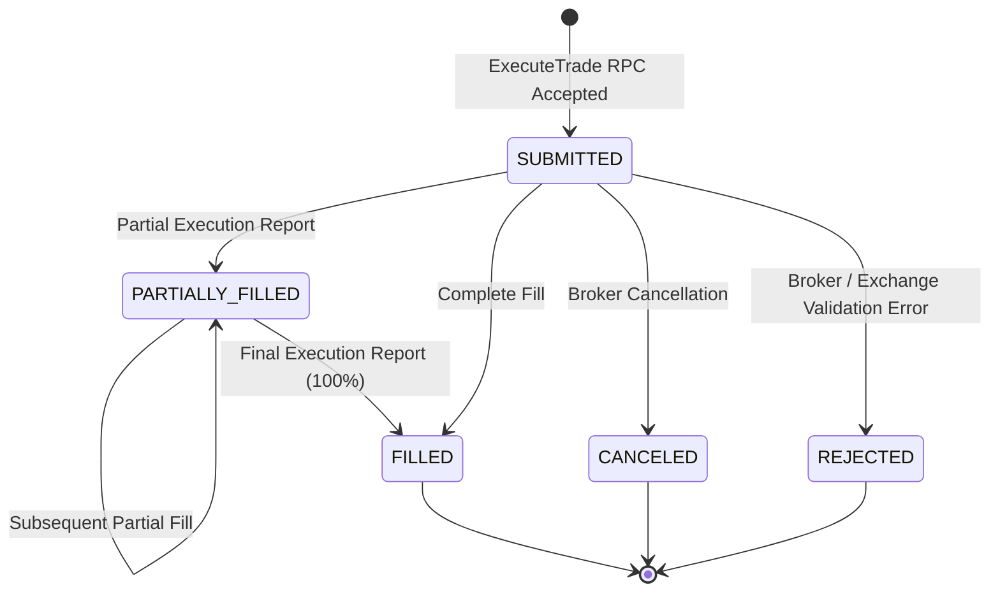
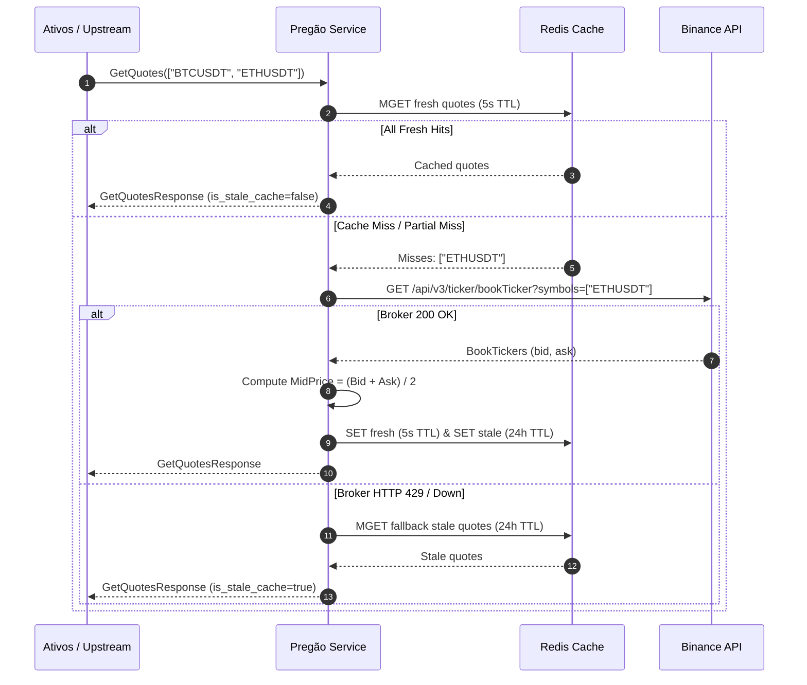
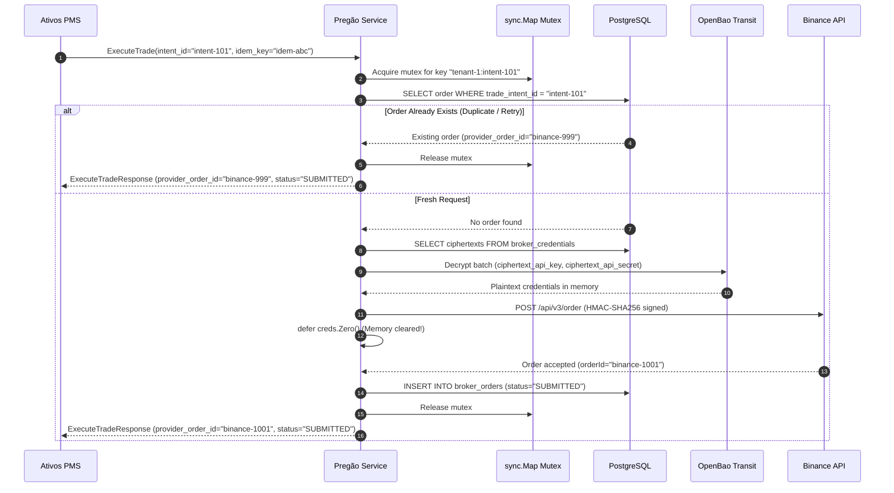
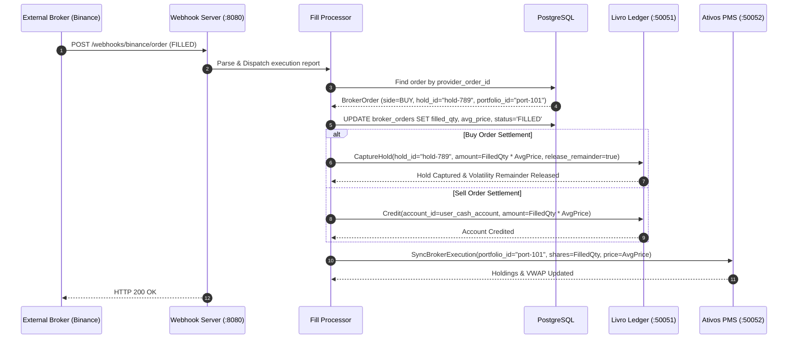

# Pregão Integration Guide & API Reference

> **Version**: 1.0.0  
> **Protocol**: gRPC / Protocol Buffers v3 & HTTP/REST (Webhooks)  
> **Proto Package**: `pregao.v1` ([`github.com/akhiljames/proto/gen/go/pregao/v1`](https://github.com/akhiljames/proto))  
> **Default gRPC Port**: `50053`  
> **Default Webhook HTTP Port**: `8080`  
> **Default Downstream Ports**: Livro Ledger (`50051`), Ativos PMS (`50052`), OpenBao Transit (`8200`)  
> **Precision Engine**: Arbitrary Precision Math via `shopspring/decimal` (Zero-Float Policy)

---

## 1. Overview & Architecture

**Pregão** is the consolidated Order Management System (OMS) and Market Data microservice for algorithmic robo-advisors, execution management platforms, and quantitative wealth systems.

Pregão occupies the **Execution & Integration Layer** of the microservice topology:
- Ingests real-time market data across external brokers (e.g. Binance) with sub-second dual-TTL caching.
- Enforces strict ticker validity before execution intents are dispatched downstream.
- Routes trade intents idempotently, backed by envelope-encrypted broker credentials decrypted just-in-time (JIT) via OpenBao.
- Ingests asynchronous broker execution fills via HTTP webhooks, settling 2PC holds with **Livro** and synchronizing portfolio asset inventories with **Ativos**.
- Performs reconciliation audits between external broker cash balances and internal double-entry ledger accounts.

```mermaid
flowchart TD
    Client["Ativos PMS / Rebalancer Engine (Port 50052)"] -->|GetQuotes / ExecuteTrade| Pregao["Pregão Core (gRPC :50053)"]

    subgraph PregaoEngine["Pregão OMS & Market Data Engine"]
        Pregao --> CacheManager["Market Data Cache Manager"]
        Pregao --> ExecRouter["Idempotent Trade Router"]
        Pregao --> Reconciler["Balance Audit & Reconciler"]
        ExecRouter --> LockMap["In-Memory Intent Locks (sync.Map)"]
    end

    subgraph SecurityTier["Zero-Trust Cryptography"]
        ExecRouter -->|Decrypt Ciphertext JIT| OpenBao["OpenBao Transit KMS (:8200)"]
        OpenBao -.->|Plaintext API Keys (Zero Memory on Exit)| BrokerClient["Binance Broker Client"]
    end

    subgraph StorageTier["State & Cache Layer"]
        CacheManager -->|5s Fresh / 24h Stale Fallback| Redis[("Redis Cache (:6379)")]
        ExecRouter -->|Order State & Idempotency| Postgres[("PostgreSQL 14+ (:5434)")]
    end

    subgraph ExternalBroker["External Liquidity Venue"]
        BrokerClient -->|HMAC-SHA256 Signed Orders| Binance["Binance REST API"]
        Binance -->|Execution Reports (Webhooks)| WebhookHandler["Webhook Server (:8080)"]
    end

    subgraph DownstreamSettlement["Settlement Pipeline"]
        WebhookHandler --> FillWorker["Async Fill Processor"]
        FillWorker -->|CaptureHold / Credit| Livro["Livro Ledger (:50051)"]
        FillWorker -->|SyncBrokerExecution| AtivosPMS["Ativos PMS (:50052)"]
    end
```

### Core Architectural Guarantees & Invariants

1. **Strict Arbitrary Precision Math (Zero-Float Policy)**:
   - Floating-point data types (`float32`, `float64`) are **strictly prohibited** in all domain logic, database schemas, calculations, and in-memory structures.
   - All prices, mid-prices, quantities, cash adjustments, and balances use `shopspring/decimal`.
   - Verified continuously via abstract syntax tree (AST) static analysis tests (`TestNoFloat32OrFloat64Enforcement`).
2. **Dual-Tier Resilient Caching (5s Fresh / 24h Stale Fallback)**:
   - Real-time bookTicker quotes are cached in Redis with a **5-second fresh TTL**.
   - Concurrently, quotes are preserved with a **24-hour stale fallback TTL**.
   - If Binance returns HTTP 429 (Rate Limit Exceeded) or network degradation occurs, Pregão immediately degrades gracefully to stale cache, serving quotes flagged with `is_stale_cache = true` without cascading downtime to upstream robo-advisors.
3. **Zero-Trust Envelope Encryption & Ephemeral Key Lifetime**:
   - Plaintext broker API keys and secrets are **never** persisted to disk or logs.
   - Plaintext credentials exist in process memory for the bare minimum execution duration and are wiped with byte-level zeroing using `defer creds.Zero()` immediately after signing HTTP requests.
4. **Guaranteed Order Idempotency & Race Condition Prevention**:
   - Every execution request requires a unique `trade_intent_id` and client `idempotency_key`.
   - In-flight duplicate requests are serialized via in-memory execution locks (`sync.Map`), ensuring that rapid bursts or retries from upstream engines result in **exactly one** broker order placement.
5. **Two-Phase Async Settlement Pipeline**:
   - Broker execution reports are received asynchronously via webhooks, persisted to PostgreSQL order records, and dispatched to:
     - **Livro**: Finalizes the 2PC hold (`CaptureHold`) for buys, releasing excess slippage buffer cash back to the investor, or credits cash (`Credit`) for sells.
     - **Ativos**: Updates actual holdings, cost basis (VWAP), and portfolio inventory (`SyncBrokerExecution`).
6. **Non-Blocking Startup & Deadlock Avoidance**:
   - Pregão initializes downstream connections to Livro and Ativos asynchronously without `grpc.WithBlock()`, completely preventing circular boot deadlocks across services.

---

## 2. Core Concepts & Data Model

### Order Lifecycle State Machine



| Order Status | Description | Action Taken |
| :--- | :--- | :--- |
| `SUBMITTED` | Order successfully signed and dispatched to broker. | Order record created in PostgreSQL. |
| `PARTIALLY_FILLED` | Partial fill received from broker webhook. | Cumulative filled quantity updated; proportional hold captured in Livro; partial shares synced to Ativos. |
| `FILLED` | Order 100% completed. | Final hold captured; remainder slippage buffer released in Livro; final shares synced to Ativos. |
| `CANCELED` | Order was canceled prior to fill. | Full hold voided in Livro; no shares added in Ativos. |
| `REJECTED` | Broker rejected execution (e.g. insufficient liquidity). | Full hold voided in Livro; trade intent flagged as failed in Ativos. |

### Mathematical Specifications

#### 1. Mid-Price Derivation
Market data mid-prices are derived from the top-of-book best bid and best ask:
$$\text{Mid Price} = \frac{\text{Best Bid Price} + \text{Best Ask Price}}{2}$$

#### 2. Balance Reconciliation Audit
Pregão reconciles external broker fiat cash against internal double-entry ledger accounts:
$$\text{Net Fiat Adjustment} = \text{Broker Fiat Balance} - \text{Ledger Fiat Balance}$$
- If $\text{Net Fiat Adjustment} = 0$: Balances are in sync (`in_sync = true`).
- If $\text{Net Fiat Adjustment} > 0$: External broker holds more cash than Livro records (fiat deposit required).
- If $\text{Net Fiat Adjustment} < 0$: External broker holds less cash than Livro records (fiat withdrawal or pending fee).

---

## 3. Quickstart & Client Setup

### Protobuf Import

Protobuf contracts are published in [`github.com/akhiljames/proto`](https://github.com/akhiljames/proto):
```bash
go get github.com/akhiljames/proto@latest
```

Import path:
```go
import (
    pregaov1 "github.com/akhiljames/proto/gen/go/pregao/v1"
)
```

### Inspecting with `grpcurl`

Using gRPC reflection on port `50053`:
```bash
# List all services
grpcurl -plaintext localhost:50053 list

# Describe PregaoService
grpcurl -plaintext localhost:50053 describe pregao.v1.PregaoService

# Fetch live quotes
grpcurl -plaintext -d '{"symbols": ["BTCUSDT", "ETHUSDT"], "provider": "BINANCE"}' localhost:50053 pregao.v1.PregaoService/GetQuotes

# Validate exchange tickers
grpcurl -plaintext -d '{"symbols": ["BTCUSDT", "INVALID_TICKER"], "provider": "BINANCE"}' localhost:50053 pregao.v1.PregaoService/ValidateTickers
```

### Go Client Initialization Helper

```go
package pregaoclient

import (
	"context"
	"fmt"
	"time"

	pregaov1 "github.com/akhiljames/proto/gen/go/pregao/v1"
	"google.golang.org/grpc"
	"google.golang.org/grpc/credentials/insecure"
)

type Client struct {
	conn   *grpc.ClientConn
	Pregao pregaov1.PregaoServiceClient
}

// NewClient dials the Pregão gRPC server.
func NewClient(addr string) (*Client, error) {
	ctx, cancel := context.WithTimeout(context.Background(), 5*time.Second)
	defer cancel()

	conn, err := grpc.DialContext(
		ctx,
		addr,
		grpc.WithTransportCredentials(insecure.NewCredentials()),
	)
	if err != nil {
		return nil, fmt.Errorf("failed to dial pregao at %s: %w", addr, err)
	}

	return &Client{
		conn:   conn,
		Pregao: pregaov1.NewPregaoServiceClient(conn),
	}, nil
}

func (c *Client) Close() error {
	return c.conn.Close()
}
```

---

## 4. gRPC API Reference & Integration Patterns

### 4.1 Real-Time Market Data (`GetQuotes`)

Retrieves real-time mid-price quotes for an array of trading symbols.

```protobuf
rpc GetQuotes(GetQuotesRequest) returns (GetQuotesResponse);

message GetQuotesRequest {
  repeated string symbols = 1; // e.g. ["BTCUSDT", "ETHUSDT"]
  string provider         = 2; // Default: "BINANCE"
}

message GetQuotesResponse {
  map<string, Quote> quotes = 1;
}

message Quote {
  string symbol         = 1; // e.g. "BTCUSDT"
  string price          = 2; // Arbitrary precision decimal string
  int64 timestamp       = 3; // Epoch milliseconds
  bool is_stale_cache   = 4; // True if served from 24h fallback cache
}
```

#### Execution Flow



#### Go Example: Fetching Quotes

```go
package main

import (
	"context"
	"fmt"
	"log"
	"time"

	pregaov1 "github.com/akhiljames/proto/gen/go/pregao/v1"
	"github.com/shopspring/decimal"
	"google.golang.org/grpc"
	"google.golang.org/grpc/credentials/insecure"
)

func main() {
	conn, err := grpc.Dial("localhost:50053", grpc.WithTransportCredentials(insecure.NewCredentials()))
	if err != nil {
		log.Fatalf("failed to connect: %v", err)
	}
	defer conn.Close()

	client := pregaov1.NewPregaoServiceClient(conn)

	ctx, cancel := context.WithTimeout(context.Background(), 3*time.Second)
	defer cancel()

	resp, err := client.GetQuotes(ctx, &pregaov1.GetQuotesRequest{
		Symbols:  []string{"BTCUSDT", "ETHUSDT", "SOLUSDT"},
		Provider: "BINANCE",
	})
	if err != nil {
		log.Fatalf("GetQuotes failed: %v", err)
	}

	for symbol, quote := range resp.Quotes {
		price, _ := decimal.NewFromString(quote.Price)
		fmt.Printf("Symbol: %s | Price: %s | Stale: %t | Updated: %s\n",
			symbol,
			price.StringFixed(2),
			quote.IsStaleCache,
			time.UnixMilli(quote.Timestamp).Format(time.RFC3339),
		)
	}
}
```

---

### 4.2 Multi-Ticker Validation (`ValidateTickers`)

Validates whether symbols exist and are actively tradeable on the broker exchange. Used by Ativos before accepting target allocation blueprints.

```protobuf
rpc ValidateTickers(ValidateTickersRequest) returns (ValidateTickersResponse);

message ValidateTickersRequest {
  repeated string symbols = 1;
  string provider         = 2;
}

message ValidateTickersResponse {
  map<string, bool> valid_symbols = 1; // Map symbol -> is_valid
}
```

#### Go Example: Validating Allocation Blueprint Tickers

```go
resp, err := client.ValidateTickers(ctx, &pregaov1.ValidateTickersRequest{
    Symbols:  []string{"BTCUSDT", "AAPLUSDT", "FAKETICKER"},
    Provider: "BINANCE",
})
if err != nil {
    log.Fatalf("ValidateTickers failed: %v", err)
}

for sym, valid := range resp.ValidSymbols {
    if !valid {
        log.Printf("⚠️ Symbol %s is invalid on provider BINANCE", sym)
    }
}
```

---

### 4.3 Idempotent Order Execution (`ExecuteTrade`)

Places a market order with the external broker, bound to a specific trade intent and idempotency key.

```protobuf
rpc ExecuteTrade(ExecuteTradeRequest) returns (ExecuteTradeResponse);

message ExecuteTradeRequest {
  string trade_intent_id          = 1; // Mandatory UUID generated by Ativos
  string tenant_id                = 2; // Multi-tenant isolation boundary
  string user_id                  = 3; // Retail investor ID
  string provider                 = 4; // "BINANCE"
  string symbol                   = 5; // e.g. "BTCUSDT"
  ExecuteTradeRequest_Side side   = 6; // BUY = 0, SELL = 1
  string quantity                 = 7; // Arbitrary precision decimal string
  string idempotency_key          = 8; // Client idempotency token
}

enum ExecuteTradeRequest_Side {
  BUY  = 0;
  SELL = 1;
}

message ExecuteTradeResponse {
  string provider_order_id = 1; // External broker order ID
  string status            = 2; // "SUBMITTED", "REJECTED"
}
```

#### Concurrency & Idempotency Guarantee Flow



#### Go Example: Idempotent Buy Execution

```go
package main

import (
	"context"
	"fmt"
	"log"
	"time"

	pregaov1 "github.com/akhiljames/proto/gen/go/pregao/v1"
	"github.com/google/uuid"
	"google.golang.org/grpc"
	"google.golang.org/grpc/credentials/insecure"
)

func main() {
	conn, err := grpc.Dial("localhost:50053", grpc.WithTransportCredentials(insecure.NewCredentials()))
	if err != nil {
		log.Fatalf("connect failed: %v", err)
	}
	defer conn.Close()

	client := pregaov1.NewPregaoServiceClient(conn)

	tradeIntentID := uuid.New().String()
	idempotencyKey := "idem-" + tradeIntentID

	req := &pregaov1.ExecuteTradeRequest{
		TradeIntentId:  tradeIntentID,
		TenantId:       "tenant-alpha",
		UserId:         "usr-retail-42",
		Provider:       "BINANCE",
		Symbol:         "BTCUSDT",
		Side:           pregaov1.ExecuteTradeRequest_BUY,
		Quantity:       "0.05000000", // Exactly 0.05 BTC
		IdempotencyKey: idempotencyKey,
	}

	ctx, cancel := context.WithTimeout(context.Background(), 10*time.Second)
	defer cancel()

	resp, err := client.ExecuteTrade(ctx, req)
	if err != nil {
		log.Fatalf("ExecuteTrade failed: %v", err)
	}

	fmt.Printf("Order Submitted Successfully!\n")
	fmt.Printf("Provider Order ID : %s\n", resp.ProviderOrderId)
	fmt.Printf("Status            : %s\n", resp.Status)
}
```

---

### 4.4 Broker Balance Reconciliation (`SyncBrokerBalances`)

Audits the user's fiat cash balance on the broker against their internal double-entry account in Livro.

```protobuf
rpc SyncBrokerBalances(SyncBrokerBalancesRequest) returns (SyncBrokerBalancesResponse);

message SyncBrokerBalancesRequest {
  string tenant_id = 1;
  string user_id   = 2;
  string provider  = 3; // "BINANCE"
}

message SyncBrokerBalancesResponse {
  bool in_sync               = 1; // True if broker fiat balance == Livro balance
  string net_fiat_adjustment = 2; // Difference (Broker - Ledger)
}
```

#### Go Example: Running Balance Audit

```go
resp, err := client.SyncBrokerBalances(ctx, &pregaov1.SyncBrokerBalancesRequest{
    TenantId: "tenant-alpha",
    UserId:   "usr-retail-42",
    Provider: "BINANCE",
})
if err != nil {
    log.Fatalf("SyncBrokerBalances failed: %v", err)
}

if resp.InSync {
    fmt.Println("✅ Broker balances and Livro ledger are in perfect parity.")
} else {
    diff, _ := decimal.NewFromString(resp.NetFiatAdjustment)
    fmt.Printf("⚠️ Discrepancy detected! Net Adjustment: $%s USD\n", diff.StringFixed(4))
}
```

---

## 5. Async Settlement & Webhooks

When external brokers execute orders, fills are ingested asynchronously over HTTP on port `8080`.

### Ingestion Endpoints

- `POST /webhooks/binance/order`: Native Binance WebSocket/Webhook `executionReport` payload.
- `POST /webhooks/orders/fill`: Generic normalized fill event payload.
- `GET /healthz`: Health and liveness probe.

### Settlement Sequence Diagram



### Simulating a Binance Execution Webhook

You can simulate a live fill using `curl`:

```bash
curl -X POST http://localhost:8080/webhooks/binance/order \
  -H "Content-Type: application/json" \
  -d '{
    "e": "executionReport",
    "E": 1727254800000,
    "s": "BTCUSDT",
    "S": "BUY",
    "o": "MARKET",
    "x": "TRADE",
    "X": "FILLED",
    "i": 1001,
    "l": "0.05000000",
    "L": "64250.0000",
    "n": "0.00003750",
    "N": "BNB",
    "T": 1727254800000
  }'
```

---

## 6. Security, Vault & Key Management

### Zero-Trust Envelope Encryption

Pregão never stores plaintext broker API keys or secrets in its database. All credentials are encrypted using OpenBao (HashiCorp Vault compatible) Transit engine:


### Ephemeral In-Memory Lifecycle & Memory Zeroing

When a trade is executed, plaintext credentials exist in memory only for the microsecond window required to generate the HMAC-SHA256 signature, after which memory is explicitly wiped:

```go
type PlaintextCredentials struct {
    APIKey    string
    APISecret []byte // Cleared with zero-byte overwrite
}

func (c *PlaintextCredentials) Zero() {
    for i := range c.APISecret {
        c.APISecret[i] = 0
    }
    c.APIKey = ""
}
```

```go
// Usage inside ExecuteTrade:
creds, err := s.vaultClient.DecryptCredentials(ctx, encCreds)
if err != nil {
    return nil, err
}
defer creds.Zero() // Guarantees wiped memory even on panic or error
```

---

## 7. Error Handling & Failure Recovery Matrix

| gRPC Status Code | Cause | Recommended Client Action |
| :--- | :--- | :--- |
| `INVALID_ARGUMENT` (3) | Missing `trade_intent_id`, non-positive quantity, unparseable decimal string, empty symbol. | Do not retry. Fix request payload. |
| `NOT_FOUND` (5) | Requested order not found in database. | Verify provider order ID. |
| `ALREADY_EXISTS` (6) | Credential record already exists for tenant/user pair. | Update existing credential. |
| `FAILED_PRECONDITION` (9) | User has not provisioned broker credentials in Vault. | Prompt user to configure API keys. |
| `RESOURCE_EXHAUSTED` (8) | External broker rate limit exceeded (HTTP 429). | Retry with exponential backoff (Pregão automatically serves stale cache for quotes). |
| `UNAVAILABLE` (14) | PostgreSQL or Redis connection temporarily unavailable. | Retry with jittered exponential backoff. |

---

## 8. Operational Runbook & Production Checklist

### Environment Variables

| Variable | Default Value | Description |
| :--- | :--- | :--- |
| `PORT` | `50053` | gRPC server listening port. |
| `HTTP_PORT` | `8080` | Webhook HTTP server listening port. |
| `DATABASE_URL` | `postgres://...` | PostgreSQL connection connection string. |
| `REDIS_ADDR` | `localhost:6379` | Redis server address. |
| `OPENBAO_ADDR` | `http://localhost:8200` | OpenBao / Vault transit address. |
| `OPENBAO_TOKEN` | `""` | Vault root or service account token. |
| `OPENBAO_TRANSIT_KEY`| `broker-keys` | Name of transit encryption key ring. |
| `BINANCE_BASE_URL` | `https://api.binance.com` | Broker REST API base URL. |
| `LIVRO_GRPC_ADDR` | `localhost:50051` | Livro Ledger gRPC service address. |
| `ATIVOS_GRPC_ADDR` | `localhost:50052` | Ativos PMS gRPC service address. |
| `DEFAULT_PROVIDER` | `BINANCE` | Default execution and market data provider. |

### Health Check Endpoints

```bash
# HTTP Liveness Probe
curl -i http://localhost:8080/healthz

# gRPC Health Inspection
grpcurl -plaintext localhost:50053 list
```

### Production Readiness Checklist

- [ ] Database schema migrations applied (`001_initial_schema.sql`).
- [ ] Redis cluster configured with adequate memory for 24h fallback cache.
- [ ] OpenBao Transit key ring `broker-keys` initialized (`scripts/init-vault.sh`).
- [ ] Outbound egress allowed to Binance REST API (`api.binance.com:443`).
- [ ] Inbound webhooks routed from edge gateway to `:8080/webhooks/...`.
- [ ] Automated AST verification passing with zero float types (`make test-precision`).
- [ ] E2E integration test client verified against test harness (`make test-e2e`).
